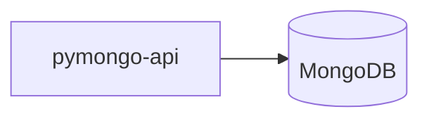
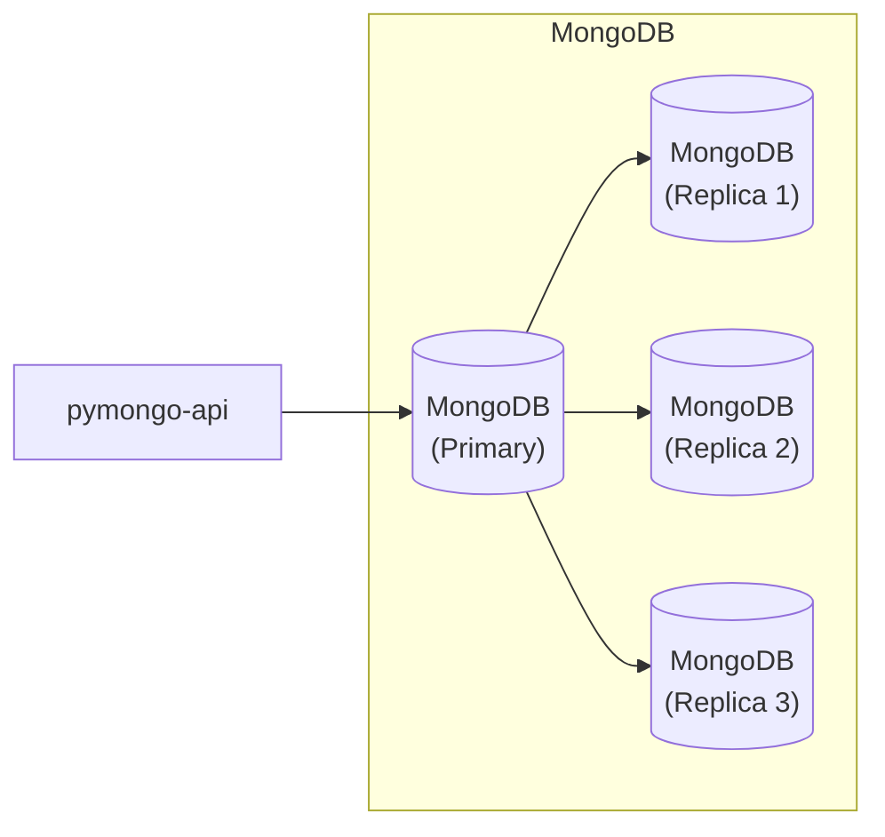
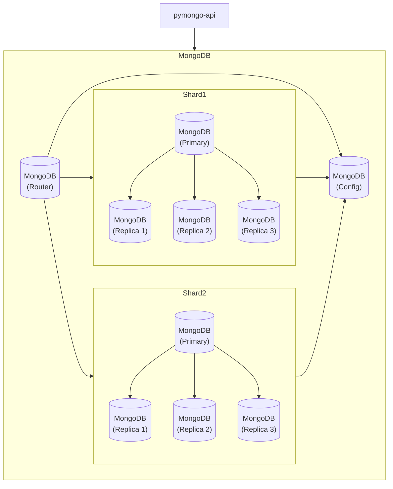
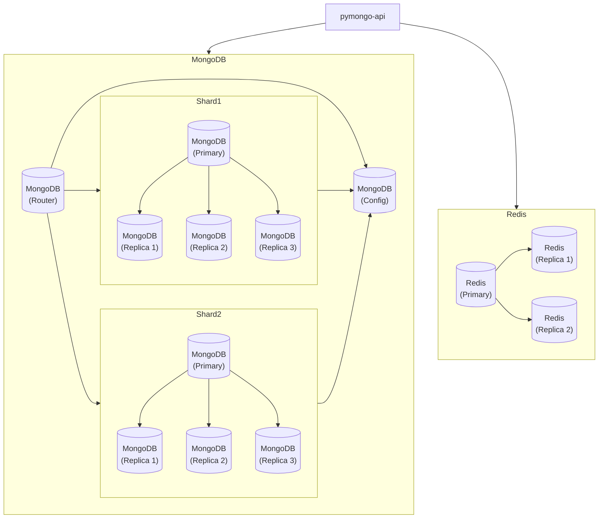
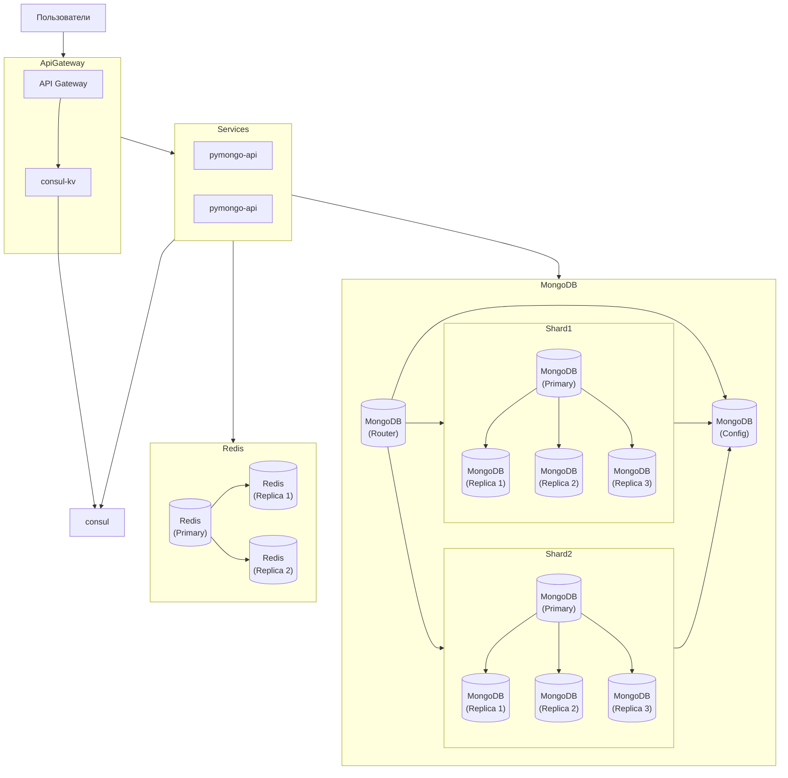
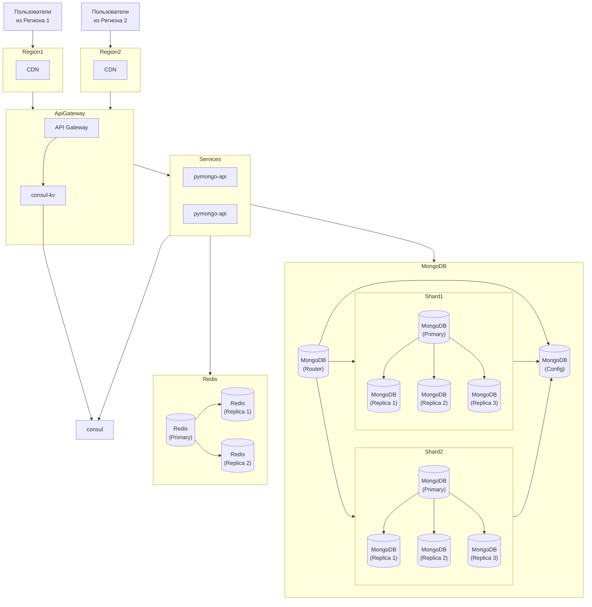

# Шардирование и репликация

## Проектирование

Проблема: сервис не справляется с нагрузками и выяснилось, что один из микросервисов — API, который работает с базой данных, — не справился с нагрузкой и повлиял на работу всего приложения - как итог: потеря многих заказов и прибыли.

Изначальная схема:

Изменения начнем с БД и настроим репликацию для `MongoDB`:

Так как сервис `pymongo-api` работает с БД, которая в свою очередь не справлялась с нагрузкой, то на схеме выше мы немного распределили нагрузку на несколько хостов: первичный (он же мастер) - на чтение и запись и 3 реплики - на чтение.

Но так как заказов будет много и хотелось бы хранить их историю, нам еще потребуется шардировать БД:

На схеме выше мы разбили БД на шарды, что позволит нам разделить данные, для маршрутизации между шардами используем 1 инстанс роутера и 1 инстанс сервера конфигурации (в дальнейшем, если возникнет потребность повысить отказоустойчивость роутера и сервера конфигурации, можно будет добавить дополнительные инстансы).

Далее добавим приложению возможность кэширования, для большей доступности - изменим код приложения, чтобы мы могли - читать/писать в мастер хост и читать с 2 реплик:

Добавим возможность динамической поставки информации о новых инстансах сервиса, используя `API Gateway` + `Consul`:

В результате получим балансировку нагрузки по сервисам приложения, если потребуется больше мощностей со стороны `API` приложения - достаточно будет поднять инстанс и зарегистрировать его в консуле, где уже `API Gateway` начнет распределять нагрузку между инстансами приложения.

Для оптимизации доставки контента (статических файлов) и улучшения `SEO` в разных регионах, добавим `CDN`, который позволит нам ускорить доставку статических файлов клиенту из своего кэша (если данных не будет в нем, то `CDN` пойдет за ними в `API Gateway`):

